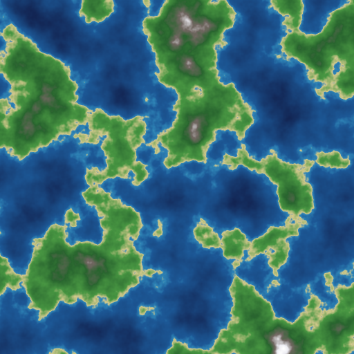

# sml-noise

Procedural noise in pure Standard ML — Perlin, simplex, value, Worley, and
fractal (fBm / turbulence) — built on [`sml-glm`](https://github.com/sjqtentacles/sml-glm)
vectors and a [`sml-prng`](https://github.com/sjqtentacles/sml-prng)-seeded
permutation table. No FFI, no external dependencies, and **deterministic for a
given seed**, byte-identically under both [MLton](http://mlton.org/) and
[Poly/ML](https://www.polyml.org/).



*Generated by [`examples/heightmap.sml`](examples/heightmap.sml) (`make
example`): six octaves of `fbm2` over `perlin2`, normalized and run through a
terrain colormap (water -> sand -> grass -> rock -> snow), encoded to PNG.*

## Status

- 31 assertions, green on MLton and Poly/ML.
- Basis-library only; deterministic across compilers.
- Vendors `sml-glm` and `sml-prng` (Layout B), so the repo builds standalone.

## Install

With [`smlpkg`](https://github.com/diku-dk/smlpkg):

```
smlpkg add github.com/sjqtentacles/sml-noise
smlpkg sync
```

Include the MLB from your own (it pulls in the vendored `sml-glm` and
`sml-prng`):

```
local
  $(SML_LIB)/basis/basis.mlb
  lib/github.com/sjqtentacles/sml-noise/... (via smlpkg)
in
  ...
end
```

This brings `structure Noise` (and the vendored `Glm`, `Prng`) into scope.

## Quick start

```sml
val ctx = Noise.fromSeed 0w20240621

val p = Noise.perlin2 ctx (1.3, 2.7)        (* signed, ~[-1,1] *)
val v = Noise.value2  ctx (1.3, 2.7)        (* in [0,1] *)
val (f1, f2) = Noise.worley2 ctx (1.3, 2.7) (* nearest / 2nd-nearest distance *)

(* fractal Brownian motion over any 2D basis *)
val params = { octaves = 5, lacunarity = 2.0, gain = 0.5 }
val mountains = Noise.fbm2 params (Noise.perlin2 ctx) (1.3, 2.7)
val clouds    = Noise.turbulence2 params (Noise.perlin2 ctx) (1.3, 2.7)
```

## What's inside

| Function | Output |
| --- | --- |
| `fromSeed : Word64.word -> t` | a seeded noise context (reuse it) |
| `perlin2`, `perlin3` | classic Perlin gradient noise; `0` at integer lattice points |
| `simplex2`, `simplex3` | Perlin's simplex noise |
| `value2`, `value3` | smoothstep value noise in `[0, 1]` |
| `worley2` | `(F1, F2)` nearest / second-nearest feature distances |
| `fbm2`, `turbulence2` | octave summation over any `real * real -> real` basis |

### Conventions

- Build one `Noise.t` per seed and reuse it; sampling is a pure function.
- Perlin/simplex are signed (≈ `[-1, 1]`); value noise is `[0, 1]`; Worley
  returns nonnegative distances with `F1 <= F2`.
- Integer-lattice coordinates are masked into `[0, 255]` without negative
  modulo, so very large and negative coordinates stay well-defined.
- `fbm`/`turbulence` with `octaves = 0` return `0.0`.
- Determinism is end-to-end: the permutation table is a `sml-prng` shuffle, so
  the whole stack reproduces the same field on both compilers.

## Build & test

```
make test        # MLton
make test-poly   # Poly/ML
make all-tests   # both
make clean
```

## License

MIT — see [LICENSE](LICENSE).
